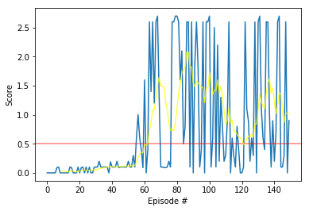

### Learning algorithm
Multi Agent Deep Deterministic Policy Gradient[(MADDPG)](https://arxiv.org/abs/1706.02275) algorithm was used for this training.<br>
DDPG applies actor-critic model-free policy gradient method for continuous spaces.<br>
The centralized critic with deterministic policies were effective in MADDPG.

### Hyper-parameters
```python
memory_params = {
    'buffer_size': int(1e6),        # replay buffer size
    'batch_size': 128,              # minibatch size
    'seed': 0,                      # Seed to generate random numbers
}
```

```python
params = {
    'gamma': 0.99,                      # discount factor
    'tau': 0.15,                        # for soft update of target parameters
    'update_every': 1,                  # update parameters per this number
    'lr_actor': 7e-4,                   # learning rate of the Actor
    'lr_critic': 3e-3,                  # learning rate of the Critic
    'seed': 0,                          # Seed to generate random numbers
    'actor_units': [512, 256],          # Number of nodes in hidden layers of the Actor
    'critic_units': [512, 256],         # Number of nodes in hidden layers of the Critic
    'weight_decay': 0,                  # L2 weight decay
    'noise_theta': 0.15,                # Theta of Ornstein-Uhlenbeck process
    'noise_sigma': 0.01,                # Sigma of Ornstein-Uhlenbeck process
}
```

I tried several learning rates for Actor and Critic among [1e-2, 3e-3, 1e-3, 7e-4, 3e-4, 1e-4].<br>
From those tests, 7e-4(lr of Actor) and 3e-3(lr of Critic) were best.<br>

Also, I tuned number of nodes in layers of Actor and Critic among [(1024, 512), (512, 256), (128, 64)].<br>
(512, 256) was best.<br>

Sigma of Ornstein-Uhlenbeck process was one of critical points.<br>
I already found it on previous Reacher project, and tested sigma with [0.2, 0.1, 0.01, 0.001].<br>
0.01 was best for this environment.<br>

I adjusted tau significantly for fast learning.<br>
The test started from tau = 0.001, but I cannot see any learning progress under 500 tries.<br>
I tested tau with [0.3, 0.2, 0.15, 0.1, 0.01, 0.001],<br>
tau = 0.15 made earliest to reach on 0.5 score after 53 episodes.<br>
With tau = 0.01, it reached on 0.5 score after 254 episodes.


### Model architectures
There are two neural networks as the actor and the critic.

* The Actor
1. First layer: (input: state size, 512)
   Activation function: Leaky ReLU
   Batch normalization: (512)
2. Second layer: (512, 256)
   Activation function: Leaky ReLU
   Batch normalization: (256)
3. Output layer: (256, action size)
   Activation function: Tanh

* The Critic
1. First layer: (input: state size, 512)
   Activation function: Leaky ReLU
   Batch normalization: (512)
2. Second layer: (512 + action size, 256)
   Activation function: Leaky ReLU
3. Output layer: (256, 1)
   Activation function: Linear

Leaky ReLU was used instead of ReLU for better performance.<br>
Also, batch normalization made an improvement.

### Plot of Rewards


### Ideas for Future Work
1. In this project, only MADDPG was tested. Multi agent PPO/TRPO or other algorithms can be tested.
2. More complex model can be tested like 3 or more layers instead of 2 layers. Also, dropout could be applied.
